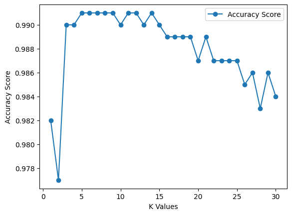
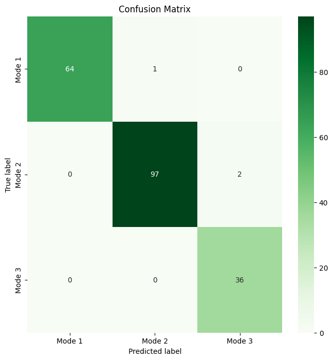
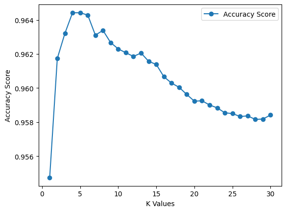
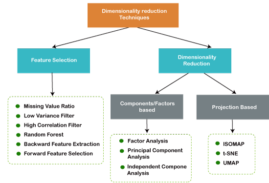
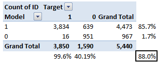
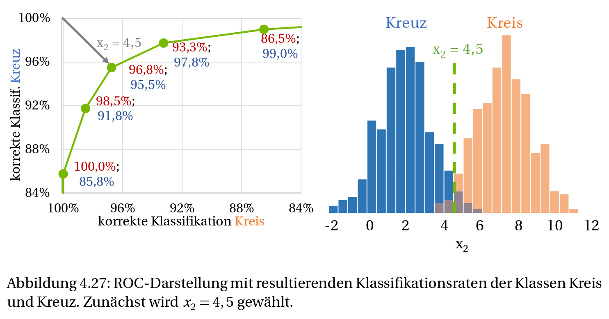
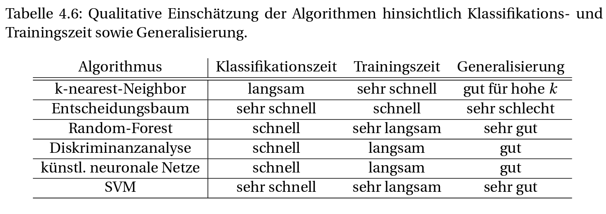

## VOCABULARY
- `Tuples`: A tuple typically consists of an input data point (or instance) and the associated output or label.
	- For example, in a dataset of images with corresponding labels indicating whether each image depicts a cat or a dog, each tuple would consist of an image and its corresponding class label (e.g., "cat" or "dog").
- `Target Attribute`: Result or y attribute
- *n_neighbors* in k-NN from scikit-learn: are the number of neighbors that will vote for the class of the target point
## Introduction in Supervised learning Project
- Full Guide - [Supervised Machine Learning | DataCamp](https://www.datacamp.com/blog/supervised-machine-learning)
## PCA Project 
> [!question]- Why does `explained_variance_ratio_` doesnt required data input x?
> The `explained_variance_ratio_` attribute in scikit-learn's PCA class doesn't explicitly need the input data `X` when accessed. The reason is that after you fit the PCA model using `pca_df.fit_transform(X)`, the model internally computes the explained variance ratios based on the data it was fitted to (i.e., `X`).

> [!question]- Explain this line of code: x = df.loc[:, features].values
> The line of code you provided is using the loc accessor in pandas to select specific columns (features) from a DataFrame (df) and then converting the selected data into a NumPy array using the .values attribute.

> [!question]- which is the valid input x of standardScaler().fit_transform(x)?
> 
> The `StandardScaler().fit_transform(x)` method in scikit-learn expects the input `x` to be a 2D array-like or sparse matrix. Specifically, `x` should be a 2D NumPy array, a pandas DataFrame, or a similar data structure.

- Guide - [Principal Component Analysis (PCA) in Python Tutorial | DataCamp](https://www.datacamp.com/tutorial/principal-component-analysis-in-python)
Explained variation per principal component

| Principal component | value   |     |
| ------------------- | ------- | --- |
| 1                   | 0.60706 |     |
| 2                   | 0.30597 |     |
| 3                   | 0.07467 |     |
| 4                   | 0.01206 |     |
| 5                   | 0.00025 |     |

## KNN Classification Project
- Full Guide - [K-Nearest Neighbors (KNN) Classification with scikit-learn | DataCamp](https://www.datacamp.com/tutorial/k-nearest-neighbor-classification-scikit-learn)

> [!question]- User what is the different between `transform` and `fit_transform` from `standardScaler()`?
> In scikit-learn's StandardScaler, both fit_transform and transform methods are used for feature scaling, but they are applied in different contexts:
> - **`fit_transform`:**
> 	- The fit_transform method is a two-step process. First, it computes the mean and standard deviation of each feature (column) in the training data using the fit part of the operation. Then, it transforms the data by standardizing it based on the computed mean and standard deviation. The fit_transform method is typically used on the training data to both compute the scaling parameters and apply the transformation.
> - **`transform`:**
> 	- The `transform` method is used for **applying the previously computed scaling** parameters to new data. It assumes that the mean and standard deviation have already been computed using the training data (by using `fit`). This method is particularly useful when you have a separate test set or new data that you want to scale using the same parameters obtained from the training data.

> [!tip]- Can classifier using categorical/discrete data as features input for supervised learning?
> Yes, classifiers can certainly use categorical data as features for supervised learning. There are various techniques and algorithms specifically designed to handle categorical features in the context of classification tasks. Here are some approaches:
> 
> 1. **One-Hot Encoding:**
>    - One common technique is to use one-hot encoding, which converts categorical variables into a binary matrix representation. Each category becomes a binary column, and the presence or absence of a category is indicated by a 1 or 0. This approach allows classifiers to work with categorical features that are initially non-numeric.
> 
>    Example:
>    ```python
>    import pandas as pd
>    from sklearn.model_selection import train_test_split
>    from sklearn.ensemble import RandomForestClassifier
>    from sklearn.metrics import accuracy_score
>    from sklearn.preprocessing import OneHotEncoder
> 
>    # Assuming df is your DataFrame with categorical features
>    X = df[['Category1', 'Category2', 'NumericFeature1', 'NumericFeature2']]
>    y = df['Target']
> 
>    # Perform one-hot encoding for categorical features
>    encoder = OneHotEncoder()
>    X_encoded = encoder.fit_transform(X[['Category1', 'Category2']])
> 
>    # Combine encoded categorical features with numeric features
>    X_combined = pd.concat([pd.DataFrame(X_encoded.toarray()), X[['NumericFeature1', 'NumericFeature2']]], axis=1)
> 
>    # Split data into training and testing sets
>    X_train, X_test, y_train, y_test = train_test_split(X_combined, y, test_size=0.2, random_state=42)
> 
>    # Create and train a classifier (Random Forest as an example)
>    clf = RandomForestClassifier()
>    clf.fit(X_train, y_train)
> 
>    # Make predictions
>    y_pred = clf.predict(X_test)
> 
>    # Evaluate the classifier
>    accuracy = accuracy_score(y_test, y_pred)
>    print("Accuracy:", accuracy)
>    ```
> 
> 2. **Ordinal/label Encoding:**
>    - Another approach is ordinal encoding, where each category is assigned a unique integer value. This method preserves the ordinal relationship among categories but might introduce an implicit order that may not exist in the original data.
> 
> 3. **Embeddings (for Neural Networks):**
>    - In the context of neural networks, embeddings can be used to represent categorical variables in a continuous vector space. This approach is particularly powerful when dealing with high-cardinality categorical features.
> 
> It's important to choose an encoding method that aligns with the nature of your categorical data and the requirements of the classifier you are using. Different classifiers may have different sensitivities to the encoding of categorical features.

> [!question]- Explain Splitting Data Function from Sklearn
> 
> The test_size parameter specifies the proportion of the data that should be allocated to the test set (in this case, 20%)
> ```python
> from sklearn.model_selection import train_test_split
> 
> # Split the data into training and test sets
> X_train, X_test, y_train, y_test = train_test_split(X, y, test_size=0.2)
> ```

> [!question]- Explain `random_state = 1` in train_test_split from sklearn 
> - In scikit-learn's train_test_split function, the random_state parameter is used to seed the random number generator. This is important when you want to ensure reproducibility of your results. Setting a specific random_state value means that every time you run the train_test_split function with the same dataset and random_state, you will get the same split between the training and testing sets.
> - The choice of 0 or 1 doesn't matter; what's important is that you consistently use the same value to reproduce the split.

> [!question]- Why does KNN need Normalizing in Data?
> When training a kNN classifier, it's essential to normalize the features. This is because kNN measures the distance between points.

> [!question]- User i have three class labels, total support equal 200. how come doesnt it add up to 1000 (total rows of dataset)?
> The "support" values in the classification_report represent the number of instances (data points) for each class in the testing set, not the total number of instances in the entire dataset. The support values are calculated based on the testing set used for evaluation, and they provide insights into the distribution of instances across different classes in the testing set.
### Handling Machine Learning Discrete/Categorical Data
- Full Guide - [Handling Machine Learning Categorical Data with Python Tutorial | DataCamp](https://www.datacamp.com/tutorial/categorical-data)
#### Numerize categorical/discrete Data for Machine Learning
- One-hot encoding: Maschine, Mode, Produkt
- Label encoding: 
	- Drehzahl, Bearbeitungszeit.
	- They are natural numerical data but present in discrete mode.
### Result
- Cross Validation
	- 
	- k = 25
- Confusion Matrix
	- 

|  | precision | recall | f1-score | support |
| ---- | ---- | ---- | ---- | ---- |
| Mode 1 | 1.00 | 0.98 | 0.99 | 65 |
| Mode 2 | 0.99 | 0.98 | 0.98 | 99 |
| Mode 3 | 0.95 | 1.00 | 0.97 | 36 |
| macro avg. | 0.98 | 0.99 | 0.98 | 200 |
| weighted avg. | 0.99 | 0.98 | 0.99 | 200 |
Accuracy: 0.98
## Decision Trees ClassificationProject
- Full Guide - [Python Decision Tree Classification Tutorial: Scikit-Learn DecisionTreeClassifier | DataCamp](https://www.datacamp.com/tutorial/decision-tree-classification-python)
### Q&A
> [!question]- Do Decision Trees Need Feature Scaling Or Normalization?
> Decision trees, including those implemented in scikit-learn (a popular machine learning library in Python), do not inherently require data normalization. Decision trees are not sensitive to the scale of the input features because they make decisions based on threshold values for individual features.
> 
> Normalization or scaling is more relevant for algorithms that rely on distance measures, such as k-nearest neighbors or support vector machines. Decision trees, being a non-distance-based algorithm, are not affected by the scale of the features.

> [!question]- What to do when the Error explain in ChatGPT doesnt make sense?
> - Let Chat GPT explain codeblock. Make sure you understand every line of code and the meaning of each parameters before you searching for Debugg in internet.

> [!failure]- InvocationException: GraphViz's executables not found
> In Stackoverflow:
> - I also had this problem on Ubuntu 16.04.
> - Fixed by running sudo apt-get install graphviz in addition to the pip install I had already performed.
> 

> [!info]- Explain this: In Scikit-learn, optimization of decision tree classifier performed by only pre-pruning.
> In the context of decision trees, optimization through pre-pruning involves controlling the growth of the tree before it becomes too complex or overfits the training data. Pre-pruning aims to stop the tree-building process at an earlier stage based on certain conditions rather than letting the tree grow to its maximum depth.

> [!info]- Explain `criterion` parameter in Decision Tree Algorithm
> In the context of decision tree algorithms, the criterion parameter is an option that allows you to specify the criterion used for choosing attribute splits in the decision tree. The criterion is essentially a measure of the impurity or quality of a split. The two commonly used criteria are "gini" and "entropy."
> 
> Here's an explanation:
> - Gini Index (criterion="gini"):
> 	- The Gini index is a measure of impurity in a set of data. For a given node in the decision tree, the Gini index assesses how often a randomly chosen element would be incorrectly identified. A lower Gini index indicates a purer node.
> 	- Decision trees that use the Gini index are often referred to as "CART" (Classification and Regression Trees) models.
> - Entropy (criterion="entropy"):
> 	- Entropy is a measure of impurity or disorder in a set of data. In the context of decision trees, it quantifies the uncertainty associated with the data. A lower entropy signifies a more organized and homogeneous set.
> 	- Decision trees that use entropy as the criterion aim to maximize information gain, making splits that result in more homogenous child nodes.

> [!question]- Explain Decision Tree Visualization CodeBlock
> - This code block is related to visualizing a decision tree using the `pydotplus` and `Graphviz` libraries in Python. Let's break down the code step by step:
> ```python
> # Visualizing Decision Trees
> dot_data = StringIO()
> export_graphviz(clf, out_file=dot_data,  
> 				filled=True, rounded=True,
> 				special_characters=True,feature_names = X.columns,class_names=['0','1'])
> graph = pydotplus.graph_from_dot_data(dot_data.getvalue())  
> graph.write_png('diabetes.png')
> Image(graph.create_png())
> ```
> 
> 1. **Initialization of StringIO:** 
> ```python
> dot_data = StringIO()
> ```
>    - `StringIO` is a module in Python that provides an in-memory file-like object. It is often used to store strings as if they were files. In this case, it's used to store the Graphviz DOT language representation of the decision tree.
> 
> 2. **Exporting Decision Tree to DOT format:** 
> ```python
> export_graphviz(clf, out_file=dot_data,   
> 			   filled=True, rounded=True,
> 			   special_characters=True, feature_names=X.columns, class_names=['0', '1'])
> ```
>    - `export_graphviz` is a function from scikit-learn that generates a Graphviz DOT format representation of the decision tree.
>    - `clf`: The trained decision tree classifier.
>    - `out_file`: The file-like object where the DOT data will be written, in this case, the `StringIO` object.
>    - `filled`, `rounded`, `special_characters`: Various options for visualizing the tree.
>    - `feature_names`: The names of the features (columns) in the dataset.
>    - `class_names`: The names of the classes or categories in the target variable.
> 
> 3. **Creating a Graph from DOT data:** 
> ```python
> graph = pydotplus.graph_from_dot_data(dot_data.getvalue())
> ```
>    - `pydotplus.graph_from_dot_data` reads the DOT data from the `StringIO` object and creates a graph.
> 
> 4. **Writing Graph to PNG File:** 
> ```python
> graph.write_png('diabetes.png')
> ```
>    - `graph.write_png` saves the decision tree visualization as a PNG file named 'diabetes.png' in the current working directory.
> 
> 5. **Displaying the Image:** 
> ```python
> Image(graph.create_png())
> ```
>    - `graph.create_png()` generates the PNG image of the decision tree.
>    - `Image()` is likely from an IPython or Jupyter environment, and it is used to display the image inline.
> 
> In summary, this code block exports a decision tree model (`clf`) to a PNG image file ('diabetes.png') by creating a Graphviz DOT representation of the tree and then converting it to an image using `pydotplus`. The resulting image is displayed using the `Image()` function.
### Results
- Decision Tree Visualization unpruned- [[Pasted image 20231227001921.png]]


|  | precision | recall | f1-score | support |
| ---- | ---- | ---- | ---- | ---- |
| Mode 1 | 1.00 | 0.98 | 0.99 | 65 |
| Mode 2 | 0.99 | 0.97 | 0.98 | 99 |
| Mode 3 | 0.92 | 1.00 | 0.96 | 36 |
| macro avg. | 0.97 | 0.98 | 0.98 | 200 |
| weighted avg. | 0.98 | 0.98 | 0.98 | 200 |
Accuracy: 0.98

- Here, the resultant tree is unpruned. This unpruned tree is unexplainable and not easy to understand. 
- In the next section, let's optimize it by pruning. - [[Pasted image 20231227002556.png]]


|  | precision | recall | f1-score | support |
| ---- | ---- | ---- | ---- | ---- |
| Mode 1 | 1.00 | 0.98 | 0.99 | 65 |
| Mode 2 | 0.99 | 0.98 | 0.98 | 99 |
| Mode 3 | 0.95 | 1.00 | 0.97 | 36 |
| macro avg. | 0.98 | 0.99 | 0.98 | 200 |
| weighted avg. | 0.99 | 0.98 | 0.99 | 200 |
Accuracy: 0.98

## Evaluation Metric Project
- Coding Evaluate Metrics for Classification - [Metrics To Evaluate Machine Learning Algorithms in Python - MachineLearningMastery.com](https://machinelearningmastery.com/metrics-evaluate-machine-learning-algorithms-python/)
- Strategy: Plot Confusion Matrix + Classification report from SKlearn
- Coding Evaluation Metrics for Regression - [Regression Metrics for Machine Learning - MachineLearningMastery.com](https://machinelearningmastery.com/regression-metrics-for-machine-learning/)
## KNN Regression Project
> [!question]- Does KNN classification process equivalent KNN regression?
> While the overall process is similar, there are a few key differences:
> 
> - Target Variable Type:
> 	- For classification, the target variable is categorical, representing classes.
> 	- For regression, the target variable is continuous, representing a numerical value.
> 
> - Evaluation Metrics:
> 	- Classification typically uses metrics like accuracy, precision, recall, and F1-score.
> 	- Regression uses metrics like mean squared error (MSE), mean absolute error (MAE), and R-squared.
> 
> - Model Initialization:
> 	- For classification, you use KNeighborsClassifier.
> 	- For regression, you use KNeighborsRegressor.
> 
> - Output Interpretation:
> 	- Classification outputs class labels.
> 	- Regression outputs numerical predictions.
> 
> Make sure to adjust the parameters and evaluation metrics based on the specific requirements of your task (classification or regression).


k = 5
- MAE: 1.2691
- MSE: 2.8585
- RMSE: 1.6907
- Relative Mean Absolute Error (MAPE): 1.3448%
- R2 Score: 0.9624
## Decision Trees Regression Project
> [!question]- Does Decision Trees Classification similar to -Regression?
> - For classification, you use DecisionTreeClassifier, while for regression, you use DecisionTreeRegressor.
> - Evaluation metrics differ: accuracy and classification report for classification, and mean squared error (MSE) for regression.
> - The training, prediction, and evaluation steps follow a similar structure.


MAE: 1.2600
Relative Mean Absolute Error (MAPE): 1.3492%
MSE: 2.4477
RMSE: 1.5645
R2 Score: 0.9678

## Knowledge
### Cross Validation
> [!question]- What is the purpose of cross validation?
> The main goals and purposes of cross-validation are:
> 
> 1. **Model Performance Estimation:**
>     - Cross-validation provides a more realistic estimate of how well a predictive model is likely to perform on new, unseen data. This is achieved by simulating the process of model training and evaluation on multiple subsets of the dataset.
> 2. **Overfitting Detection:**
>     - Overfitting occurs when a model learns the training data too well but fails to generalize to new data. Cross-validation helps detect overfitting by assessing the model's performance on different subsets of the data. If a model consistently performs well across all subsets, it is likely to generalize better.
> 3. **Optimizing Hyperparameters:**
>     - Many machine learning algorithms have hyperparameters that need to be tuned for optimal performance. Cross-validation is used in hyperparameter tuning to assess how different parameter choices impact the model's performance on multiple subsets of the data, helping to find the best set of hyperparameters.
> 4. **Reducing Variance in Performance Estimates:**
>     - By averaging performance metrics obtained from multiple rounds of training and testing on different data subsets, cross-validation helps reduce the variance in performance estimates. This provides a more stable and reliable evaluation of the model.
> 5. **Maximizing Data Utility:**
>     - In situations where the dataset is limited, cross-validation allows for better utilization of available data. Instead of having a fixed training and testing set, cross-validation ensures that each data point is used for both training and testing in different iterations.

> [!question]- What does `cross_val_score` essentially do?
> Yes, that's correct. In scikit-learn, the `cross_val_score` function is used to perform cross-validation on a machine learning model and compute a performance metric, such as accuracy. This function is part of the model selection module (`sklearn.model_selection`).
> 
> Here's a general overview of how `cross_val_score` works:
> 
> 1. **Input:**
>    - You provide the machine learning model (an estimator), the dataset (features and target), and specify the number of folds or cross-validation strategy.
> 
> 2. **Process:**
>    - The function divides the dataset into the specified number of folds (or uses the specified cross-validation strategy) and iteratively trains and evaluates the model on different subsets of the data.
> 
> 3. **Training and Evaluation:**
>    - For each iteration (fold), the model is trained on a subset of the data (training set) and evaluated on a different subset (validation or test set).
> 
> 4. **Performance Metric:**
>    - The performance metric (e.g., accuracy, precision, recall) is computed for each iteration.
> 
> 5. **Output:**
>    - The function returns an array of performance scores, one for each fold. You can then analyze these scores to understand the model's performance across different subsets of the data.
> 
> Here's a simple example using `cross_val_score` to perform 5-fold cross-validation and compute accuracy scores:
> 
> ```python
> from sklearn.model_selection import cross_val_score
> from sklearn.ensemble import RandomForestClassifier
> from sklearn.datasets import load_iris
> 
> # Load dataset
> iris = load_iris()
> X, y = iris.data, iris.target
> 
> # Create a RandomForestClassifier
> clf = RandomForestClassifier()
> 
> # Perform cross-validation and compute accuracy scores
> accuracy_scores = cross_val_score(clf, X, y, cv=5, scoring='accuracy')
> 
> # Print the accuracy scores
> print("Accuracy Scores:", accuracy_scores)
> ```
> 
> In this example, `cv=5` specifies 5-fold cross-validation, and `scoring='accuracy'` indicates that the accuracy score should be computed for each fold. The resulting `accuracy_scores` array contains the accuracy score for each iteration of the cross-validation process.
### Distance Measurement
Your choice of distance measure is a critical step in clustering, and it depends on the problem you’re trying to solve. Considering the following scenario, we could cluster students based on any number of approaches such as their: 
- Country of origin
- Gender, either male or female
- Previous academic background.
These are all valid clusters but differ in meaning. 
Even though Euclidean distance is the most common distance used in most clustering software, other distance measures such as Manhattan distance, Canberra distance, Pearson or Spearman correlation, and Minkowski distance exist.
### Supervised Learning
- Based on the given data sets, the machine learning problem is categorized into two types: Classification and Regression.
	- If the given data has both input (training) values and output (target values) -> classification problem.
	- If the dataset has continuous numerical values of attributes without any target labels, then it is a regression problem.
	- Example
		- Is it a Cat or Dog?
		- How much will the house sell for?
#### Classification
- Classification is a prediction problem that **predicts the categorical class labels**, which are discrete and unordered.
- Two step process: Learning step and a classification step.
- Available **Techniques**:
	- Logistic Regression
	- Decision Tree Classifier
	- K Nearest Neighbor Classifier
	- Random Forest Classifier
	- Neural Networks
#### Regression
- Available Techniques:
	- Linear Regression
	- Decision Tree Regressor
	- K Nearest Neighbor Regressor
	- Random Forest Regressor
	- Neural Networks
> [!tldr]- Machine Learning basic step
> - The dataset is split into a training set and test set.
> - The test set is used to estimate the predictive accuracy of a classifier.
> - To achieve higher accuracy, the best way is to test out different algorithms and try different parameters within each algorithm -> the best one can be selected by **cross validation**.
> 	- Evaluation parameter: accuracy, training time, linearity, number of parameters and special cases
> 	- Vergleich zu Kenzahlen für Klassifikatoren: Genauigkeit, Sensitivität und Spezifität, Positiver und negativer Vorhersagewert, F1-Score
### K-Nearest neighbors
- An algorithm is said to be a lazy learner if it simply stores the tuples of the training set and waits until the test tuple is given.
- Based on learning by analogy, k-NN compares a given test tuple with training tuples that are similar to it.
- When given an unknown tuple, a k-NN classifier searches the pattern space for the **k training tuples** that are closet to the unknown tuple.
	- Dieser Wert klein gewählt, so ist das Ergebnis sehr stark von der unmittelbaren Umgebung des Datenpunktes, und damit von eventuellen Ausreißern, abhängig.
	- If k is chosen too large, many neighboring points and thus a large radius will be included in the classification, which also has a negative effect.
- "closeness" is defined regarding a distance metric, such as Euclidean distance. 
- A good value for K is determined experimentally.
	- In der Praxis ist es sinnvoll, den Klassifikator mit verschiedenen Werten für k zu testen und dann **einen möglichst kleinen Wert für k** zu wählen, der noch robuste Ergebnisse liefert. Generell gilt, größere Datensätze mit einer höheren Anzahl an Datenpunkten jeder Klasse ermöglichen größere Werte von k und sind damit robuster.
- die Klassifikationszeit, also die Zeit für die Klassifizierung eines einzelnen Datenpunktes, linear von der Gesamtanzahl der Datenpunkte abhängt. -> k-nearest-Neighbor-Algorithmus ist daher für sehr große Datensätze problematisch.
- Auslegung point: k-Neighbor.
### Decision Tree
#### How Does the Decision Tree Algorithm Work?
The basic idea behind any decision tree algorithm is as follows:
1. Select the best attribute using Attribute Selection Measures (ASM) to split the records.
2. Make that attribute a decision node and breaks the dataset into smaller subsets.
3. Start tree building by repeating this process recursively for each child until one of the conditions will match:
    - All the tuples belong to the same attribute value.
    - There are no more remaining attributes.
    - There are no more instances.


#### Attribute Selection Measures
- Not quiet understand
### Theorie der Dimensionalität
> [!question]- Is there any approach to reduce dimensionality to discrete/categorical features?
> Yes, dimensionality reduction approaches can be applied to datasets with discrete features. However, the choice of method may vary based on the nature of the data and the specific characteristics of the discrete features. Here are a few common approaches:
> 
> 1. **One-Hot Encoding and PCA:**
>    - For categorical (discrete) features, one common preprocessing step is to use one-hot encoding to convert them into numerical format. After encoding, you can apply Principal Component Analysis (PCA) to reduce dimensionality. Keep in mind that PCA assumes linearity, so interpret the results carefully.
> 
> 2. **Multiple Correspondence Analysis (MCA):**
>    - MCA is a dimensionality reduction technique specifically designed for categorical data. It extends PCA to handle categorical variables more effectively.
> 
> 3. **Factor Analysis of Mixed Data (FAMD):**
>    - FAMD is another method for dimensionality reduction that can handle both numerical and categorical features.
> 
> 4. **t-Distributed Stochastic Neighbor Embedding (t-SNE):**
>    - t-SNE is a non-linear dimensionality reduction technique that can be used with both numerical and discrete features. It's often used for visualization.
> 

- Dimensionalität: spricht über Anzahl der Eigenschaften Datensatz nötig, um Klassifikationen von eine Eigenschaft abzubilden und zu beschreiben.
- At the same time, each additional property increases the distances between individual data points from each other by increasing the dimensionality.
- Ansatz zur Reduzierung der Dimensionalität
	1. Es werden so lange Eigenschaften aus dem Trainingsdatensatz entfernt, bis sich keine Verbesserung mehr (oder eine Verschlechterung) des Ergebnisses einstellt. 
	2. Mehrere Eigenschaften werden unter Ausnutzung ihrer Korrelation miteinander kombiniert, wodurch sich die Anzahl der erforderlichen Dimensionen reduziert.
> [!cite]+ Image [(p. 88)](zotero://open-pdf/library/items/M97SCPAP?page=88&annotation=LVRTGMN4)
> 
> ****

- Informationsverlust Rechnung durch Bestimmtheitsmaß R^2
- Arte von Kombi
	- Nimmt eine Eigenschaft von Korrelationspaar.
	- oder bestimmt regressionsgerade und nutzt dies as Eigenschaften (Manuell verfahren).
	- Statistische Verfahren - PCA: Same like above but the transformationmatrix will be calculated by statische verfahren.
- Hauptkomponentenanalyse (PCA)
	- Function: turn high-dimensional data into a low-dimensional principal component.

### Evaluation Metrics for Classification
- Full Guide - [12 Important Model Evaluation Metrics for Machine Learning](https://www.analyticsvidhya.com/blog/2019/08/11-important-model-evaluation-error-metrics/)
#### Q&A
> [!tip]- Q1. What are evaluation metrics in machine learning?
> 
> A. Evaluation metrics quantify the performance of a machine learning model. It involves training a model and then comparing the predictions to expected values.

> [!tip]- Q2. What are the 4 metrics for evaluating classifier performance?
> A. Accuracy, confusion matrix, log-loss, and AUC-ROC are the most popular evaluation metrics used for evaluating classifier performance.
> 

> [!summary]- Explain `classification_report()` sklearn
> The `classification_report` function in scikit-learn is a utility that generates a comprehensive report of key classification metrics for a classification model. It provides a summary of various metrics, including precision, recall, F1-score, and support, for each class in the classification task.
> 
> Here is an overview of the components of the `classification_report`:
> 
> 1. **Precision:**
>    - Precision is the ratio of true positives to the sum of true positives and false positives. It measures the accuracy of positive predictions made by the model.
> 
> 2. **Recall (Sensitivity):**
>    - Recall is the ratio of true positives to the sum of true positives and false negatives. It measures the ability of the model to capture all positive instances.
> 
> 3. **F1-Score:**
>    - The F1-score is the harmonic mean of precision and recall. It provides a balance between precision and recall and is especially useful when there is an imbalance between classes.
> 
> 4. **Support:**
>    - Support is the number of actual occurrences of each class in the specified true targets. It represents the number of instances belonging to each class in the dataset.
> 
> 5. **Accuracy:**
>    - Accuracy is the ratio of correctly predicted instances to the total number of instances. It measures the overall correctness of predictions.
> 
> The `classification_report` function takes as input the true labels (`y_true`) and the predicted labels (`y_pred`) and outputs a formatted text report that includes precision, recall, F1-score, and support for each class, as well as macro-averaged and weighted-averaged metrics.
> 
> Here is an example of how to use `classification_report`:
> 
> ```python
> from sklearn.metrics import classification_report
> 
> # Assuming y_true and y_pred are your true and predicted labels
> print(classification_report(y_true, y_pred))
> ```
> 
> This will print a report similar to the following:
> 
> ```plaintext
>               precision    recall  f1-score   support
> 
>    Class 0       0.80      0.85      0.82       100
>    Class 1       0.70      0.65      0.67        50
> 
>    accuracy                                   0.77       150
>   macro avg       0.75      0.75      0.75       150
> weighted avg       0.77      0.77      0.77       150
> ```
> 
> This report provides a detailed breakdown of the model's performance for each class and overall. It is a valuable tool for evaluating and interpreting the results of a classification model.
> 
> !Notice: "macro avg" and "weighted avg" are two different ways of averaging the precision, recall, and F1-score metrics across multiple classes. These averages provide insights into the overall performance of a classification model, especially in scenarios where class distribution is imbalanced.
> Macro avg treats all classes equally, while weighted avg considers the distribution of instances across classes. The choice between them depends on the specific goals and characteristics of the classification problem you are dealing with.

> [!tip]- Matzka Comments about Confusion Matrix (Wahrheitsmatrix)
> In der Praxis ist der Nutzen der vier Kennzahlen Sensitivität, Spezifität sowie positiver und negativer Vorhersagewert zweifelhaft. Können Sie ohne nachzusehen noch sicher sagen, welches Verhältnis damit genau dargestellt wird? In vielen Gesprächen tragen diese Kennzahlen dadurch eher zur Verwirrung bei, anstatt Klarheit zu schaffen. Überdies wurden die vier Felder der Wahrheitsmatrix durch vier Kennzahlen ersetzt, ein zweifelhafter Vorteil. Daher ist es empfehlenswert, stets anhand der Wahrheitsmatrix zu entscheiden, die auch durch die vorgestellten Kennzahlen am Matrixrand ergänzt werden kann, wie in Tabelle 4.11 (similar to Image in Confusion Matrix below) dargestellt.

> [!tip]- Why there is Positive and Negative Classification in Confusion Matrix
> Its a **subjective** Evaluation. Its common when you classified binare values. For more than two class like Betriebmodus in AI UB 03 is this positive/negative not relevant anymore
#### Confusion Matrix (Wahrheitsmatrix)
A confusion matrix is an N X N matrix, where N is the number of predicted classes. For the problem in hand, we have N=2, and hence we get a 2 X 2 matrix. It is a performance measurement for machine learning classification problems where the output can be two or more classes. Confusion matrix is a table with 4 different combinations of predicted and actual values. It is extremely useful for measuring precision-recall, Specificity, Accuracy, and most importantly, AUC-ROC curves.
- **True Positive:** You predicted positive, and it’s true.
- **True Negative:** You predicted negative, and it’s true.
- **False Positive: (Type 1 Error):** You predicted positive, and it’s false.
- **False Negative: (Type 2 Error):** You predicted negative, and it’s false.
- **Accuracy (Genauigkeit):** the proportion of the total number of correct predictions that were correct.
- **Positive Predictive Value or Precision (Pos. Vorhersagewert):** the proportion of positive cases that were correctly identified. This measures the total number of true positives divided by the total number of predicted positives.
- **Negative Predictive Value (Neg. Vorhersagewert):** the proportion of negative cases that were correctly identified.
- **True Positive Rate (TPR) or Sensitivity or Recall (Sensitivität**): the proportion of actual positive cases which are correctly identified. This measures the total number of true positives divided by the total number of actual positives.
- **False Positive Rate (FPR) or Specificity (Spezifität): the proportion of actual negative cases which are correctly identified.
- **Rate:** It is a measuring factor in a confusion matrix. It has also 4 types TPR, FPR, TNR, and FNR.

> [!abstract] Confusion Matrix Summary
> 



#### The Role of a Confusion Matrix
- To better comprehend the confusion matrix, you must understand the aim and why it is widely used.
- When it comes to measuring a model’s performance or anything in general, people focus on accuracy. However, being heavily reliant on the accuracy metric can lead to limited decisions. Detailed breakdown by Confusion Matrix offers valuable benefits as follows:
	- **Working with imbalanced data**: No data ever comes perfect, and the use of the accuracy metric should be evaluated on its predictive power. For example, working with a dataset where one class outweighs another will cause the model to achieve a higher accuracy rate as it will predict the majority class.
	- **Error types**: Understanding and learning about your model's performance in a specific context will aid you in fine-tuning and improving its performance. For example, differentiating between the types of errors through a confusion matrix, such as FP and FN, will allow you to explore the model's limitations.
	- **Trade-offs**: The trade-off between using different metrics in a Confusion Matrix is essential as they impact one another. For example, an increase in precision typically leads to a decrease in recall. This will guide you in improving the performance of the model using knowledge from impacted metric values.
#### F1 Score - Regulating Parameter for Extreme Case
In the last section, we discussed precision and recall for classification problems and also highlighted the importance of choosing a precision/recall basis for our use case. What if, for a use case, we are trying to get the best precision and recall at the same time? F1-Score is the **harmonic mean** of precision and recall values for a classification problem. The formula for F1-Score is as follows:


Now, an obvious question that comes to mind is why you are taking a harmonic mean and not an arithmetic mean. This is because HM **punishes extreme values more**. Let us understand this with an example. We have a binary classification model with the following results:

_Precision: 0, Recall: 1_

Here, if we take the arithmetic mean, we get 0.5. It is clear that the above result comes from a dumb classifier that ignores the input and predicts one of the classes as output. Now, if we were to take HM, we would get 0 which is accurate as this model is useless for all purposes.

This seems simple. There are situations, however, for which a data scientist would like to give a percentage more importance/weight to either precision or recall. Altering the above expression a bit such that we can include an adjustable parameter beta for this purpose, we get:


Fbeta measures the effectiveness of a model with respect to a user who attaches β times as much importance to recall as precision.
#### ROC
An **ROC curve** (**receiver operating characteristic curve**) is a graph showing the performance of a classification model at all classification **thresholds**. This curve plots two parameters:
- True Positive Rate (TPR)
- False Positive Rate (FPR)
An ROC curve plots TPR vs. FPR at different classification thresholds. Lowering the classification threshold classifies more items as positive, thus increasing both False Positives and True Positives. The following figure shows a typical ROC curve.
undefined
> [!cite]+ Image [(p. 143)](zotero://open-pdf/library/items/M97SCPAP?page=143&annotation=UI839L9I)
> 
> ****

#### Generalisierung
- It evaluate if the model overfitted, generalised or underfitted
### Evaluation Metrics for Regression
- Full Guide - [Know the best evaluation metrics for Regression](https://www.analyticsvidhya.com/blog/2021/05/know-the-best-evaluation-metrics-for-your-regression-model/)

> [!question]- Which metric is best for Evaluation Regression Model?
> 1. **Mean Absolute Error (MAE):**
>    - **Formula:** $MAE = \frac{1}{n} \sum_{i=1}^{n} |y_i - \hat{y}_i|$ 
>    - **Interpretation:** MAE represents the average absolute difference between the actual and predicted values. It is easy to understand and less sensitive to outliers.
> 
> 1. **Mean Squared Error (MSE):**
>    - **Formula:**  $MSE = \frac{1}{n} \sum_{i=1}^{n} (y_i - \hat{y}_i)^2$ 
>    - **Interpretation:** MSE measures the average squared difference between the actual and predicted values. It penalizes larger errors more heavily than MAE.
> 
> 1. **Root Mean Squared Error (RMSE):**
>    - **Formula:** $RMSE = \sqrt{MSE}$ 
>    - **Interpretation:** RMSE is the square root of MSE and provides a measure of the average magnitude of the errors in the same units as the target variable.
> 
> 1. **R-squared (R² or Coefficient of Determination):**
>    - **Formula:** $R^2 = 1 - \frac{\sum_{i=1}^{n} (y_i - \hat{y}_i)^2}{\sum_{i=1}^{n} (y_i - \bar{y})^2}$ 
>    - **Interpretation:** R-squared represents the proportion of the variance in the target variable that is explained by the model. It ranges from 0 to 1, with higher values indicating better model fit.
> 
> 1. **Mean Absolute Percentage Error (MAPE, relative MAE):**
>    - **Formula:** $MAPE = \frac{1}{n} \sum_{i=1}^{n} \frac{|y_i - \hat{y}_i|}{|y_i|} \times 100$ 
>    - **Interpretation:** MAPE is similar to MPE but uses absolute values, making it suitable for avoiding the issue of canceling out positive and negative errors.

### Algorithm Quantitative Comparision
> [!cite]+ Image [(p. 136)](zotero://open-pdf/library/items/M97SCPAP?page=136&annotation=2HPVJ8FZ)
> 
> ****