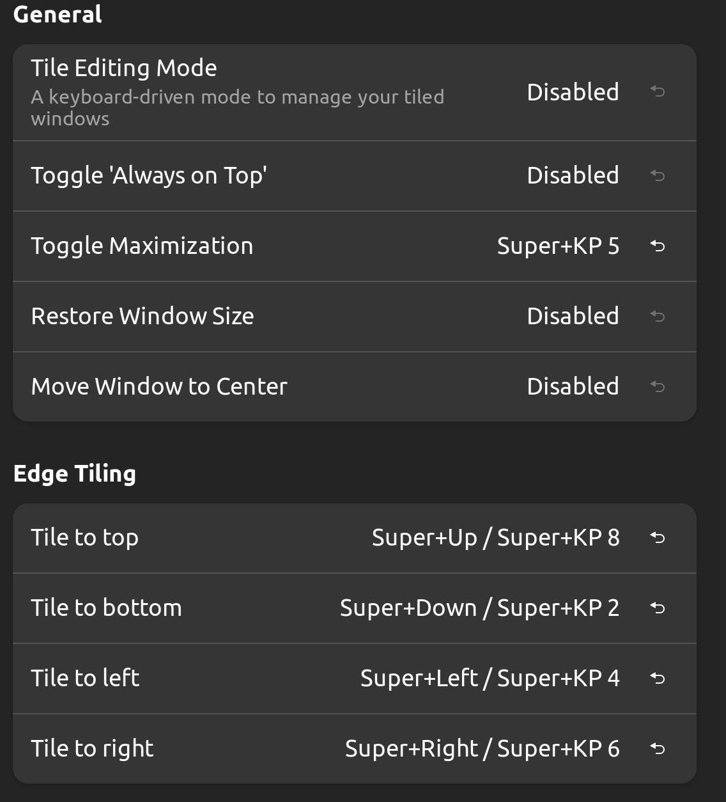

## Rules
- No pip install
## Update/Install software through Download file (Debian file)
```
sudo apt install ./<file>.deb
```
## Update Firefox (incase Notification reappear again)
```
sudo killall firefox
sudo snap refresh
```
## Install Flatpak for Appstore
```
sudo apt install flatpak
```
## Disable Auto Update Ubuntu
- [Disable Automatic Updates on Ubuntu 22.04 Jammy Jellyfish Linux - Linux Tutorials - Learn Linux Configuration](https://linuxconfig.org/disable-automatic-updates-on-ubuntu-22-04-jammy-jellyfish-linux)
## Setup Custom Shortcut for Launching Application
- *Settings/Keyboard > Keyboard Shortcuts: View and Customize Shortcuts > Custom Shortcuts* 
- Its required command to launch the applications
- command of specific app can be found under *Properties > Launcher > Command:*
- File path depend on AppStore Distributor
### Flatpak
```
/var/lib/flatpak/exports/share/applications
```
### Debian apt
```
/usr/share/applications/
```
### Snap
- Is Ubuntu Default, therefore only name of app in command is enough.
## Edit PDF & Image file
- [[PDF]]
## General
### Get Adress of file
- Copy File
- Paste in Terminal
### Extension Manager
```
sudo apt install gnome-shell-extension-manager
```
### Improve Touchpad in X11/Xorg
- Full Guide: [How to Enable Touchpad Gestures in Ubuntu 22.04 on Xorg Session | UbuntuHandbook](https://ubuntuhandbook.org/index.php/2022/06/touchpad-gestures-ubuntu-22-04-xorg/)
```
sudo add-apt-repository ppa:touchegg/stable
sudo apt install touchegg
```
- *Extension > Browse > X11Gestures* 
### Speed up Startuptime
```
sudo apt install preload
```
### Reinstall
```bash
sudo apt install --reinstall input
```
### Backup System
- Timeshift
### Firewall
- firewall
### Cleanup Space
- Bleachbit
### Update and Upgrade ubuntu
```
sudo apt update && sudo apt upgrade 
```
### Update Snapstore
```
snap-store --quit && sudo snap refresh snap-store
```
### Mathlab
- [Install Matlab](https://www.youtube.com/watch?v=ZNHJkCo5sOc)
### Commandline history
- *Thunar > Home > View > Show Hidden Files > .bash_history*
### Quater Window snap
- *Extension > Tiling Assistant*
- To Disable: TIling Popup, Tile Groups
- Custom Shortcuts
	- 
### Install Command
```
sudo apt install package-one
```
### Manage Startup Programm
- Full Guide: [Complete Guide for Managing Startup Applications in Ubuntu Linux: Learn to Add, Remove or Delay Startup Programs](https://itsfoss.com/manage-startup-applications-ubuntu/)
- find command of each apps in "Main Menu"
- Copy in "Startup Application"
- Show hidden Startup 
```
sudo sed -i "s/NoDisplay=true/NoDisplay=false/g" /etc/xdg/autostart/\*.desktop
```
- Hide hidden Startup 
```
sudo sed -i "s/NoDisplay=false/NoDisplay=true/g" /etc/xdg/autostart/\*.desktop
```
### Move file to permission required folder
Full Guide: [clipboard - How to copy files into /usr/local/? (permission denied) - Ask Ubuntu](https://askubuntu.com/questions/24952/how-to-copy-files-into-usr-local-permission-denied)
```
/usr/local/bin/
sudo -H nautilus
```
### Preview a File 
`sudo apt-get install gnome-sushi`
### Remove RotationScreen
`sudo apt-get remove iio-sensor-proxy`
### Stop RotationScreen
```
sudo systemctl stop iio-sensor-proxy.service
sudo systemctl disable iio-sensor-proxy.service
```

### Set a default Audio Output
```
sudo -H gedit /etc/pulse/default.pa
Comment out the line 
	load-module module-switch-on-connect
restart puseaudio with 
	pulseaudio -k
```


